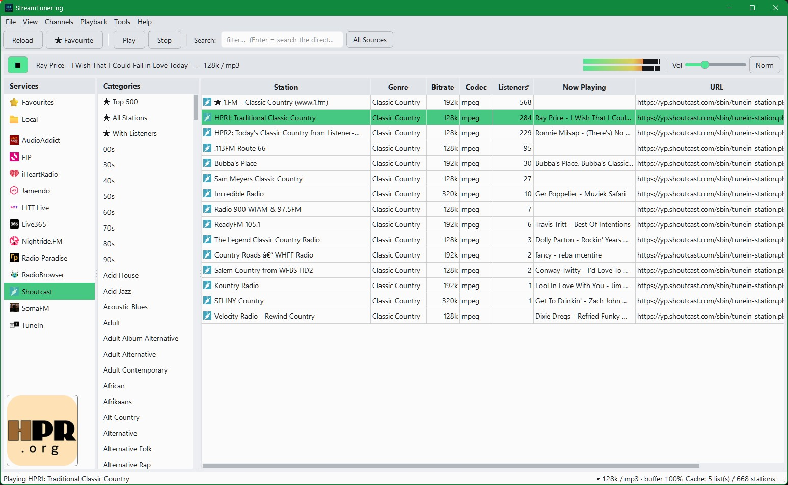
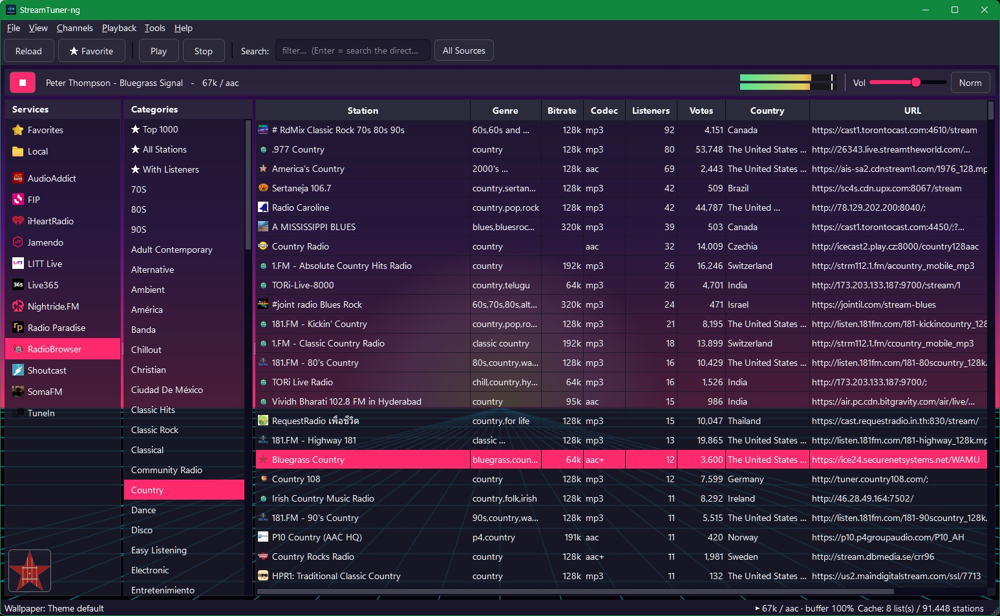

# StreamTuner-ng

A modern, cross-platform **internet-radio browser** — a from-scratch port & reimagining of
the much-loved **StreamTuner2**, rebuilt in **PySide6 (Qt 6)** with embedded **libmpv** audio.

Pick a directory, browse by genre, or **search every source at once** — click a station and
it plays. Designed so a broken or slow directory can never take the whole app down.

## Features

**A dozen built-in directories**, plus your own **Favorites** and a **Local** list of your
streams. **Everything is free to listen to with no account — except AudioAddict**, whose free tier
was discontinued, so it needs a paid subscriber listen key. Some services also sell subscriptions
worth supporting if you love them:

| Service | Free to Listen? | Subscription Price | What a Subscription Adds |
|:--|:-:|:--|:--|
| **AudioAddict**<br>*DI.FM · RadioTunes · JazzRadio · ClassicalRadio · RockRadio* | ❌ **Subscription Needed** | **~$7.99/mo** · ~$69.99/yr<br>*(one sub = all 5 networks)* | **Plays ad-free in the app** with your key · plus skip, track rating, on-demand & mobile/car apps *(in DI.FM's own app)* |
| **FIP** | ✅ Yes | Free for listeners | *Public radio — nothing to buy* |
| **iHeartRadio** | ✅ Yes | Plus **$5.99/mo** · All Access **$11.99/mo** | **Plus:** ad-free radio, unlimited skips, save & replay · **All Access:** + on-demand library + offline |
| **Jamendo** | ✅ Yes | Free for listeners | *Paid plans are commercial licensing, not listening* |
| **LITT** | ✅ Yes | ~$4.99/mo *(iOS)* | Ad-free listening *(HQ stream unconfirmed)* |
| **Live365** | ✅ Yes | Free for listeners | *Paid plans are for broadcasters only* |
| **Nightride.FM** | ✅ Yes | Free for listeners | *Optional Patreon adds bonus / early releases* |
| **Radio Paradise** | ✅ Yes | Free for listeners | *Already free — including lossless **FLAC / CD-quality*** |
| **RadioBrowser** | ✅ Yes | Free for listeners | *Free & open community directory / API* |
| **SHOUTcast** | ✅ Yes | Free for listeners | *Paid plans are broadcaster hosting only* |
| **SomaFM** | ✅ Yes | Free for listeners | *Commercial-free; voluntary donations only* |
| **TuneIn** | ✅ Yes | **$9.99/mo** · $79.99/yr | Ad-free music (30+ commercial-free channels), commercial-free news, NHL + college + motorsports, 100k+ audiobooks |

*Listener subscriptions in USD, as of June 2026 — web sign-up; mobile app-store prices run higher.*

> 💛 **Love a station? Support it.** These services share their streams for free — if one becomes a
> favorite, **subscribe or donate** to keep it (and the artists) going. StreamTuner-ng plays the free
> streams; **AudioAddict** is subscriber-only — paste your listen key to play its networks ad-free
> here. For the full premium experience — skip, track rating, on-demand, mobile & car apps — use each service's own app.

- **Global search** — type to filter the loaded list instantly, press **Enter** to search a
  directory's whole catalog, or flip on **All Sources** to query every directory at once and
  merge the results.
- **Favorites & history** — star stations; CSV import/export to back them up or share.
- **Twenty built-in themes + your own** — Dark, Light, Dracula, Nord, Solarized (light & dark),
  Gruvbox (dark & light), Tokyo Night, Monokai Pro, Dark Pastels, Cyberpunk Neon, Ubuntu, xterm, plus
  retro **Amber / Green / White phosphor, CGA, CRT, and Synthwave** — or import/export a custom theme
  as JSON (see **[THEME-HOWTO.md](THEME-HOWTO.md)**). **Options → Themes → Wallpaper** offers a picker —
  a generated **Synthwave** grid, two **Vaporwave** backgrounds, or your own image on any theme, with a dim slider.
- **Extensible** — drop a `.py` channel into the plugins folder to add your own directory
  (see **[PLUGINS.md](PLUGINS.md)**); a worked `_example.py` is provided. Plugins can even declare
  their own **right-click options** (e.g. a bitrate picker or a login-key field) with no UI code.
- **Visualizers** — a stereo VU meter or a scrolling spectrum in the player bar.
- **Desktop integration** — system tray (now-playing, play/pause, close-to-tray), desktop
  notifications, Discord Rich Presence, loudness normalization, and keyboard + media keys.
- **Fast** — station and genre lists are cached to disk, so relaunch is instant and it isn't
  re-downloading on every start.




## Install

### Release binary
Grab the latest from the **[Releases](https://github.com/IronWolve/StreamTuner-ng/releases)** page.
- **Windows** — libmpv is bundled; just run the `.exe`.
- **Linux** — install libmpv first (`sudo apt install libmpv2`), then run the binary. On a plain
  X11 desktop you may also need `sudo apt install libxcb-cursor0`.

### From source
```bash
python -m venv .venv && . .venv/bin/activate      # Windows: .venv\Scripts\activate
pip install -r requirements.txt
python run.py
```
Audio needs **libmpv**: on Debian/Ubuntu `sudo apt install libmpv2`; on Windows put
`libmpv-2.dll` next to `run.py` (or just use the release binary).

`python run.py --selftest` runs a headless self-check (airlock + live channels, no display
required).

## Make it yours

| | |
|---|---|
| **Themes** | Options → Themes — pick one, set a **wallpaper** (or your own image), or Import / Export a JSON theme |
| **Plugins** | Tools → Open Plugins Folder — drop a `.py` channel in (copy `_example.py`) |
| **Local stations** | File → New Local Station — add any stream URL |
| **AudioAddict** | Paste your listen key (Options → General **or** right-click the channel → *Set Listen Key*); right-click → **Bitrate** for 320 / 128 / 64 kbps. Subscriber-only — no free tier. |
| **Backup &amp; cache** | Options → **Cache &amp; Data** — disk usage, **station-icon storage** (Off / On / Downscaled), clear caches, open your data folder, and **export / import** your settings + favorites/history/local as JSON |
| **Your data lives in** | `~/.config/streamtuner-ng/` (Linux) · `%APPDATA%\streamtuner-ng\` (Windows) |

## Why it's solid

The headline difference from the original is a **crash-isolation airlock**: every directory
call runs behind a timeout and an exception guard, so a source that hangs, errors, or returns
garbage is contained while the rest of the app keeps working. Add the disk cache and a headless
self-test, and it stays responsive and predictable even when a radio directory is having a bad day.

## Heritage & credits

StreamTuner-ng carries forward the idea of **StreamTuner2** — browse internet-radio directories
as pluggable "channels" — but it is a complete, ground-up rebuild in modern Python/Qt, not a
copy of the original (GTK, Public Domain) code. **Ported & reimagined by IronWolve.**
See **[NOTICE](NOTICE)** for license and attribution notes.

- Audio — **libmpv** (LGPL)
- UI — **Qt 6 / PySide6** (LGPL)
- Stations — RadioBrowser, SomaFM, Shoutcast, TuneIn, and the other directories listed above —
  **please support the ones you love** (subscribe or donate)

Project code is licensed under **Apache-2.0** — see [LICENSE](LICENSE) and [NOTICE](NOTICE).
Source: <https://github.com/IronWolve/StreamTuner-ng>
